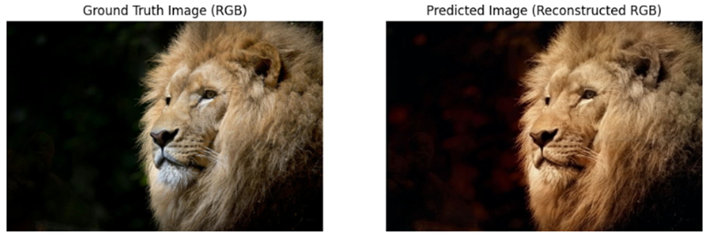
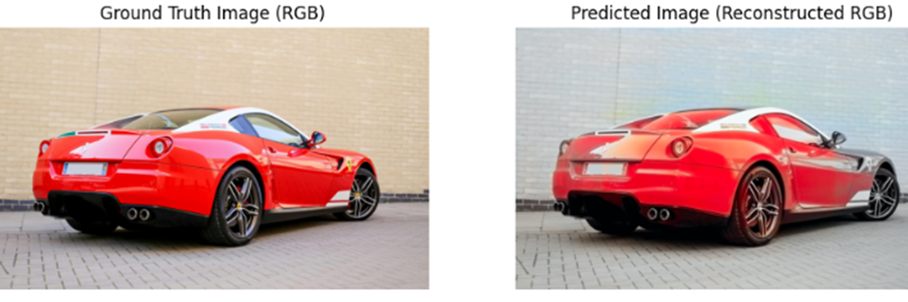
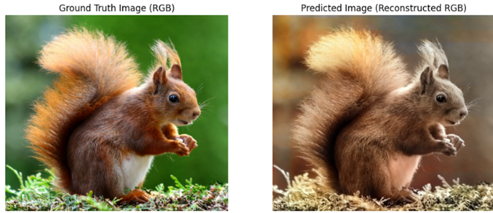

# 🎨 UNet Colorization - Training & Checkpointing with WandB
This project trains a **UNet** model for colorizing grayscale images using the **Lab Color Space**. The entire training process is tracked using **Weights & Biases (WandB)**, with the checkpoint system stored as **Artifacts**, making it easy to resume training from a previous checkpoint.

---

## 📌 **Project Structure**
```
Unet_Colorization/
├── config.py                # Configuration file for training parameters
├── data_loader.py           # Handles data loading and transformation
├── model.py                 # Defines the UNet model architecture
├── train.py                 # Training script & checkpoint management
├── main.py                  # Entry point for starting or resuming training
├── README.md                # Documentation (you're reading this!)
└── requirements.txt         # Dependencies required to run the project
```

---

## ⚙️ **Setup Instructions**
First, install the required dependencies:
```bash
pip install -r requirements.txt
```
Or install them manually:
```bash
pip install torch torchvision numpy scikit-image matplotlib tqdm wandb gdown
```
---

## 🚀 **How to Use ?**
```bash
python demo_release.py -i path_gray_image -o path_output
```
---
## 🎨 Colorization Results




---
---

## 🚀 **How to Training ?**
### **Train from Scratch**
```bash
python main.py --mode scratch
```
This will train the UNet model from scratch using the configuration specified in `config.py`.

### **Continue Training from Checkpoint**
```bash
python main.py --mode continue --checkpoint_path "wandb_artifact_path"
```
This will resume training from a previously saved checkpoint stored in **WandB Artifacts**.

---

## ⚙️ **Configuration (`config.py`)**
Modify `config.py` to adjust the training parameters:
```python
# Training from scratch configuration
TRAIN_FROM_SCRATCH = {
    "TRAIN_DATASET_PATH": "/path/to/train/",
    "VAL_DATASET_PATH": "/path/to/val/",
    "BATCH_SIZE": 32,
    "EPOCHS": 20,
    "LR": 4e-4,
    "NUM_WORKERS": 4,
    "TRAIN_SIZE": 118000,
    "VAL_SIZE": 5000,
    "WANDB_PROJECT": "image-colorization",
    "WANDB_RUN_NAME": "Unet",

}

# Continue training configuration
CONTINUE_TRAINING = {
    "TRAIN_DATASET_PATH": "/path/to/train/",
    "VAL_DATASET_PATH": "/path/to/val/",
    "BATCH_SIZE": 32,
    "EPOCHS": 36,
    "LR": 4e-4,
    "NUM_WORKERS": 4,
    "TRAIN_SIZE": 118000,
    "VAL_SIZE": 5000,
    "WANDB_PROJECT": "image-colorization-123k",
    "WANDB_RUN_NAME": "Unet",

}
```

---

## 🔄 **Saving Checkpoints with WandB**
### **Checkpoints are automatically saved as WandB Artifacts**
- The checkpoint is saved as `checkpoint_epoch_X.pth` (where `X` is the epoch number).
- Checkpoints are stored as **WandB Artifacts**, allowing easy resumption of training.

Example:
```python
save_checkpoint_as_artifact(epoch, net_G, optimizer, scheduler, wandb.run.id, "checkpoint_epoch")
```

---

## 🔍 **Loading Checkpoints from WandB Artifact**
When resuming training, the project **automatically downloads the latest checkpoint from WandB**:
```python
artifact = run.use_artifact(wandb_artifact_path, type="model")
artifact_dir = artifact.download(root=".")
```
It will then load the **latest checkpoint** from the artifact directory and continue training from there.


## 📜 **License & Acknowledgements**
📌 **Author**: tinhvu 

📌 **This project is built using PyTorch and Weights & Biases to manage training**


## 🌟 **Happy Training!** 🚀🚀🚀

